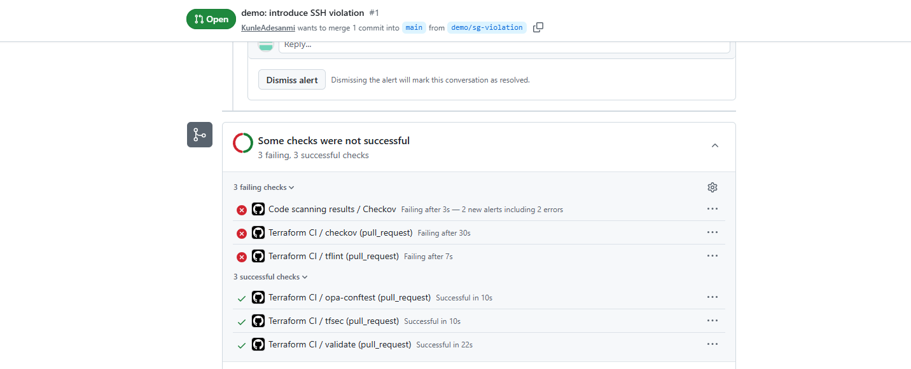
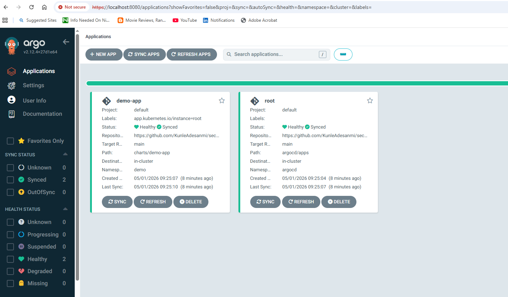
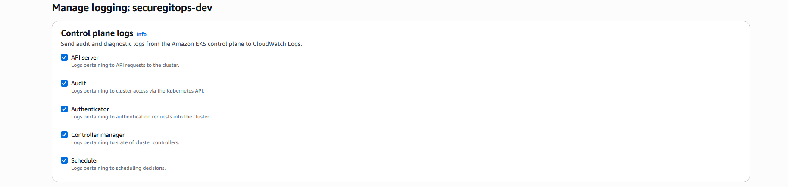
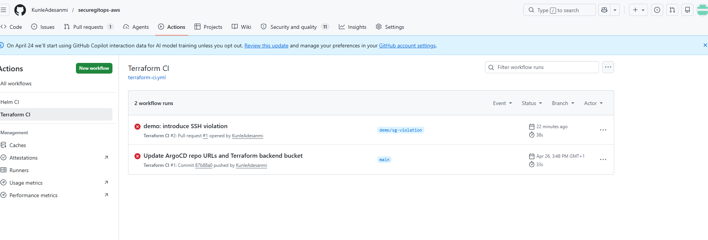
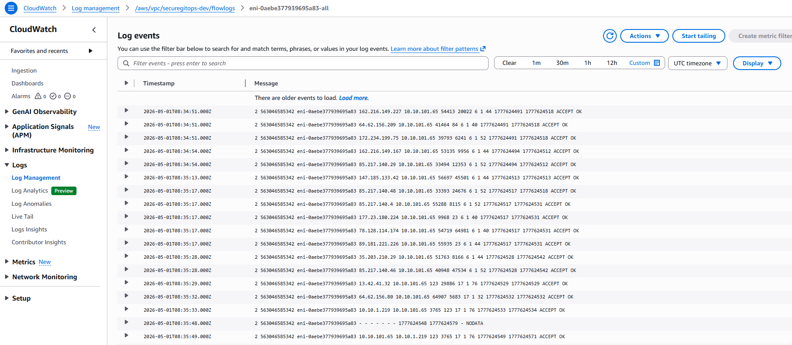

# SecureGitOps on AWS EKS

A production-style, security-first GitOps platform demonstrating end-to-end DevSecOps on AWS: modular Terraform, policy-as-code in CI, multi-region EKS, and Helm/ArgoCD GitOps delivery.


---

## Why this project exists

This project shows *how* — with the security gates, modular boundaries, and operational tooling that distinguish a working prototype from something you'd actually run in production.

Every design decision in this repo is deliberate, commented, and traceable to a real-world threat or operational concern. The accompanying [runbook](docs/runbook.md) walks through how I'd respond to common incidents in this stack.

---

## What this project demonstrates

| Capability | Implementation |
|---|---|
| Modular, reusable Terraform | `terraform/modules/{vpc,eks,irsa}/` — each module is region-agnostic and composed by environment |
| Multi-region strategy (active + DR) | `terraform/environments/dev-eu-west-2/` (primary) and `dev-eu-west-1/` (pilot light) |
| VPC, subnets, routing, flow logs | Three-AZ layout, per-AZ NAT, locked-down default SG, all traffic logged to CloudWatch |
| Hardened EKS provisioning | KMS envelope encryption, full control-plane logging, IRSA via OIDC, IMDSv2 enforced on nodes |
| Policy-as-code in CI/CD | tfsec, Checkov, custom OPA/Rego policies, kubeconform, kube-linter — all gating merges |
| GitOps with ArgoCD + Helm | App-of-apps pattern, auto-sync, self-heal, prune; declarative everything |
| Hardened Helm chart | Non-root, read-only root FS, dropped capabilities, seccomp `RuntimeDefault` |
| Python automation | Drift detection across environments, secrets rotation with rolling restart |
| Bash automation | Idempotent backend bootstrap, ArgoCD installation |
| Operational evidence | Runbook for sync failures, flow log investigation, tfsec exceptions, DR failover |

---

## Architecture summary

**Primary region (eu-west-2):** Active EKS cluster, ArgoCD, application workloads. VPC with three AZs, private subnets for nodes, NAT-per-AZ to avoid cross-AZ data transfer charges. All control-plane log types enabled (api, audit, authenticator, controllerManager, scheduler) for CIS compliance.

**DR region (eu-west-1):** Same Terraform modules, smaller node group (pilot light). Non-overlapping CIDR (`10.20.0.0/16`) leaves room for future VPC peering. Failover documented in the runbook.

**Delivery flow:** PR → CI security gates → merge → Terraform applies infrastructure changes → ArgoCD continuously reconciles cluster state with Git. Application changes never touch `kubectl` directly.

---

## Evidence

### 1. Policy-as-code blocks insecure changes before merge



A deliberately introduced `0.0.0.0/0` ingress rule on port 22 is caught by the custom OPA policy in `policies/opa/security.rego` before the PR can be merged.

### 2. GitOps loop running with auto-sync and self-heal



The `root` Application manages all child applications via the app-of-apps pattern.

### 3. Live EKS cluster with full control plane logging



All five control plane log types are enabled — required for CIS benchmark compliance.

### 4. CI history showing active enforcement



Every PR triggers five parallel jobs. Branch protection requires all to pass before merge. (Work In Progress)

### 5. VPC flow logs streaming to CloudWatch



Flow logs answer "did pod X actually talk to the database?" during incident response.


---

## Repository layout

```
securegitops-aws/
├── README.md
├── .github/workflows/
│   ├── terraform-ci.yml
│   └── helm-ci.yml
├── terraform/
│   ├── modules/{vpc,eks,irsa}/
│   └── environments/{dev-eu-west-2,dev-eu-west-1}/
├── policies/opa/
├── scripts/
├── argocd/{install,apps}/
├── charts/demo-app/
└── docs/
```

---

## Quick start

Prerequisites: AWS CLI configured, Terraform 1.6+, kubectl, Helm 3.x, Python 3.10+.

```
# 1. One-time backend bootstrap
./scripts/bootstrap.sh eu-west-2

# 2. Update each environment's backend.tf with the bucket name printed by bootstrap.sh

# 3. Provision the primary cluster (~15 minutes)
cd terraform/environments/dev-eu-west-2
terraform init
terraform apply

# 4. Install ArgoCD into the cluster
cd ../../..
./argocd/install/install.sh securegitops-dev eu-west-2

# 5. Bootstrap the app-of-apps — ArgoCD takes over from here
kubectl apply -f argocd/apps/root-app.yaml

# 6. Watch the demo-app sync
kubectl -n argocd port-forward svc/argocd-server 8080:443
```

To tear everything down:

```
cd terraform/environments/dev-eu-west-2
terraform destroy
```

See [docs/TUTORIAL.md](docs/TUTORIAL.md) for the detailed walkthrough.

---

## Security controls implemented

**Network layer**
- VPC flow logs to CloudWatch (30-day retention)
- Default security group locked (no ingress/egress rules)
- Private subnets for all node workloads; NAT egress only

**EKS layer**
- All five control-plane log types enabled
- KMS envelope encryption for Kubernetes Secrets at rest
- IRSA enabled via OIDC provider
- IMDSv2 enforced on all nodes via launch template

**Workload layer**
- Pods run as non-root (UID 101)
- Read-only root filesystem
- All Linux capabilities dropped
- `seccompProfile: RuntimeDefault`

**CI/CD layer**
- tflint, tfsec, checkov, OPA/conftest on every PR
- Helm lint + kubeconform + kube-linter on chart changes
- Branch protection requires all checks before merge

---

## Operational tooling

`scripts/drift-check.py` — detects drift across all environments via `terraform plan -detailed-exitcode`. Suitable for scheduled CI runs.

`scripts/secrets-rotate.py` — rotates a value in AWS Secrets Manager, then triggers a rolling restart of consuming EKS deployments via the Kubernetes Python client.

`scripts/test_secrets_rotate.py` — unit tests using `moto` to mock AWS.

---

## Cost note

Estimated AWS spend: ~£2-3 per day with the primary cluster running. `terraform destroy` removes everything.

---

## Limitations and what I'd add for production

- Observability stack — Prometheus, Grafana, Loki
- Service mesh — Istio or Linkerd for mTLS
- External Secrets Operator
- AWS Organizations multi-account layout with SCPs
- Karpenter for node autoscaling
- Backup tooling (Velero) and DR drill automation

Each is a project in its own right; collapsing them here would dilute the demonstration.

---

## License

MIT

---

## Contact

Ade — [LinkedIn] — [email]
